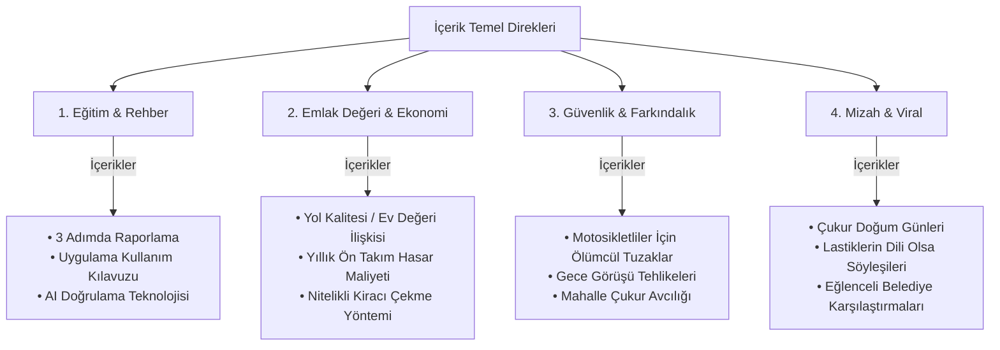

# Alo Çukur Hattı — Sosyal Medya Kampanya Omurgası (Campaign Backbone) 🏛️🛡️

Bu döküman, **Alo Çukur Hattı** platformunun lansmanı, büyümesi ve toplumsal etkileşimini en üst düzeye çıkarmak için kurulan sosyal medya kampanya yapısını ve stratejik omurgasını tanımlar.

---

## 🎯 1. Kampanya Hedefleri ve KPI'lar

Uygulamanın yayılması ve belediyeler üzerinde eyleme dökülebilir sivil baskı oluşturabilmesi için belirlenen ana hedefler:

* **İndirme & Aktif Kullanım:** Adana öncelikli olmak üzere, ilk 3 ayda **10.000+ organik indirme**.
* **İhbar Hacmi:** Aylık **2.500+ doğrulanmış yol hasarı ihbarı** toplanması.
* **Onarım / Çözüm Oranı:** İhbar edilen sorunların belediyelerce onarılma oranını şeffaf şekilde **%60 üzerine** çıkarmak.
* **Topluluk Büyümesi:** Instagram, TikTok ve YouTube kanallarında toplam **25.000+ takipçili** aktif bir sivil topluluk.

---

## 👤 2. Hedef Kitle Personaları

Kampanyanın hitap ettiği 3 ana kitle grubu:

### A. Sürücüler (Otomobil, Motosiklet, Bisiklet Sahipleri)
* **Ağrı Noktası:** Bozuk yollar yüzünden oluşan yüksek tamir masrafları, jant/lastik hasarları, iki tekerlekli araç sürücüleri için ölümcül kaza tehlikesi.
* **Motivasyon:** Güvenli, konforlu ve masrafsız yollarda seyahat etmek.
* **İçerik Dikey:** "Yol Güvenliği", "Hasar Maliyeti", "Gece Sürüşü Tuzakları".

### B. Gayrimenkul Yatırımcıları ve Ev Sahipleri (Emlak Kitlesi)
* **Ağrı Noktası:** Sokak altyapısının bakımsız olması nedeniyle mülkün prestij kaybetmesi, kira değerinin veya satış priminin düşmesi.
* **Motivasyon:** Bulunduğu sokağın standartlarını yükselterek gayrimenkulün değerini %10-15 artırmak.
* **İçerik Dikey:** "Emlak Değeri", "Kira Geliri Artışı", "Ev Alırken Altyapı Kontrolü".

### C. Aktif Sivil Vatandaşlar (Yerel Kahramanlar)
* **Ağrı Noktası:** Bireysel belediye şikayetlerinin (dilekçe vb.) yavaş işleme alınması, muhatap bulamama.
* **Motivasyon:** Mahallesini güzelleştirmek, toplumsal fayda sağlamak, sıralama ve rozetlerde yükselerek lider olmak.
* **İçerik Dikey:** "Çukur Avcıları", "Liderlik Sıralaması", "Sivil İnisiyatifin Gücü".

---

## 🏛️ 3. İçerik Temel Direkleri (Content Pillars)

Tüm platformlarda üretilecek içerikler 4 ana sütun üzerine oturtulmuştur:

---

## 🔄 4. Çok Kanallı İçerik Hunisi (Multi-Channel Funnel)

### 📸 Instagram (Güven, Estetik ve Detay)
* **Format:** Kaydırmalı Carousels (Playwright ile üretilen 15 set) + Collabs (Adana emlak danışmanlarıyla ortak paylaşımlar) + Stories (Raporlandı / Çözüldü "Önce-Sonra" paylaşımları).
* **Görev:** Kullanıcıda güven uyandırmak, uygulamanın teknik şeffaflığını anlatmak, gayrimenkul ve yatırım faydalarını detaylandırmak.

### 🎵 TikTok & Reels (Viralite ve Eğlence)
* **Format:** Hızlı geçişli videolar + MoneyPrinter ile üretilen sesli/altyazılı stok videolar + Çukur Doğum Günü gibi ironik sokak röportajları.
* **Görev:** Geniş kitlelere ulaşmak, paylaşım rekorları kıran viral içeriklerle organik bilinirlik oluşturmak.

### 🎥 YouTube Shorts & Long-form (Otorite ve Eğitim)
* **Format:** Kısa Shorts videoları + 2 dakikalık "Neden ve Nasıl Çalışır?" detaylı platform tanıtım videoları.
* **Görev:** Arama hacminden trafik çekmek (Örn: "Yol hasarı nedeniyle araç tazminatı nasıl alınır?", "Belediyeye yol şikayeti nasıl yapılır?").

---

## ⚙️ 5. Teknolojik Otomasyon ve Araç Seti

İçerik üretim süreçlerinin sürekli ve düşük maliyetli olabilmesi için kullanılan yerel altyapı:

1. **Görsel Tasarım Sistemi:** `alocukurhatti/sosyalmedya/create_all_carousels.py` (HTML/CSS şablonlarını saniyeler içinde 1080x1080 PNG kaydırmalı görsellere çevirir).
2. **Video Üretim Sistemi:** `MoneyPrinterTurbo` (Pexels API entegrasyonu, Azure Edge TTS ses sentezleme ve otomatik altyazı birleştirme).
3. **Belediye Rapor Dağıtım Sistemi:** Python ile yapılandırılmış ve koordinat verilerini doğrudan ilgili resmi e-posta adreslerine raporlayan altyapı.
